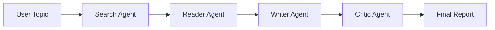

# Multi-Agent Research System

> A polished, agent-driven research assistant that turns a simple topic into a structured, professional report through collaboration between specialized AI agents.


---

## ✨ Overview

This project showcases a compact but powerful multi-agent AI workflow designed to mimic a modern research desk.

Instead of asking one model to do everything at once, the system distributes the job across four specialized roles:

- Search Agent — gathers relevant and recent information from the web
- Reader Agent — digs deeper into promising sources
- Writer Agent — composes a structured report
- Critic Agent — reviews the final output and provides feedback

The result is a workflow that feels more like a real research team than a single chatbot interaction.

---

## 🧠 How It Works



### Workflow in Brief

1. The user enters a topic.
2. The Search Agent finds relevant web results.
3. The Reader Agent extracts deeper content from the best sources.
4. The Writer Agent transforms that research into a polished report.
5. The Critic Agent evaluates the report and offers constructive feedback.

---

## 🔥 Why This Project Stands Out

- Modular agent architecture
- Clear separation of responsibilities
- A practical example of tool-using LLM systems
- Both terminal-based and web-based execution
- Strong educational value for agentic AI development

---

## 🧩 Project Structure

```text
Multi-Agent-System/
├── agents.py          # Agent and chain definitions
├── app.py             # Streamlit web interface
├── pipeline.py        # CLI pipeline runner
├── tools.py           # Tavily search + scraping tools
├── requirements.txt   # Python dependencies
├── notes/             # Project notes and planning details
└── .env               # API keys and environment variables
```

---

## 🛠️ Key Files

- [agents.py](agents.py) — defines the search, reading, writing, and critic agents/chains
- [tools.py](tools.py) — provides the custom search and scraping tools
- [pipeline.py](pipeline.py) — runs the full research pipeline from the command line
- [app.py](app.py) — provides a polished Streamlit interface for the same workflow

---

## 🚀 Quick Start

### 1. Create a virtual environment

```bash
python3 -m venv .venv
source .venv/bin/activate
```

### 2. Install dependencies

```bash
pip install -r requirements.txt
```

### 3. Configure your environment

Create a `.env` file in the project root:

```env
MISTRAL_API_KEY=your_mistral_api_key
TAVILY_API_KEY=your_tavily_api_key
```

> The project currently uses a Mistral-based LLM and Tavily for live web search.

---

## ▶️ Run the Project

### Terminal version

```bash
python pipeline.py
```

Enter a research topic when prompted and watch the full pipeline execute step by step.

### Web UI version

```bash
streamlit run app.py
```

This launches an interactive interface where the same research flow is presented in a more visual and engaging format.

---

## 🧰 Tech Stack

- Python
- LangChain
- LangChain Mistral integration
- Streamlit
- Tavily API
- BeautifulSoup
- Requests
- Python-dotenv

---

## 📌 Example Outcome

A user might ask:

> “What are the latest developments in solid-state batteries?”

The system would then:

1. Search the web for recent information
2. Read the best sources in depth
3. Draft a report
4. Review the quality of the report and provide feedback

---

## 🌟 Future Possibilities

This project can be extended with:

- persistent memory for long-term context
- multi-agent debate or review loops
- exportable reports to PDF or Markdown
- saved research history in a database
- authentication and user accounts

---

## ⭐ Project Goal

To demonstrate a practical and visually engaging multi-agent research system that transforms a simple prompt into a structured, high-quality research report.
